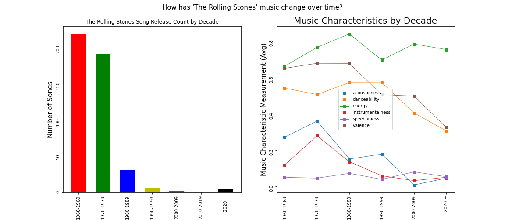
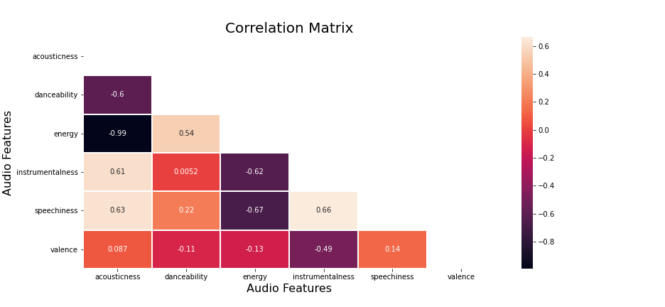
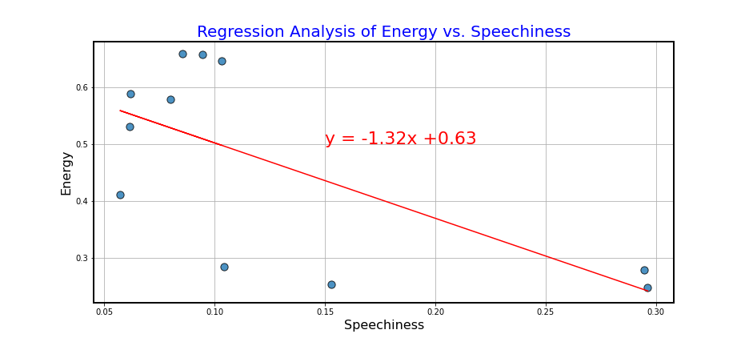

# Spotify_Music_Analysis


### Data Munging, Exploratory and Statistical Analysis of 174k+ tracks and 10+ audio features of Spotify Data Set with songs released in between 1921 and 2021.

## Table of contents
* [Introduction ](#introduction )
* [Objectives ](#objectives)
* [Questions and Hypothesis ](#questions-and-hypothesis )
* [Methodology](#methodology)
* [Data Cleaning and formatting](#data-cleaning-and-formatting)
* [Data Analysis, Visualization and Summary](#data-analysis-and-visualization)
* [Technologies and Tools](#technologies)
* [Setup](#setup)
* [Status](#status)
* [Acknowledgement ](#acknowledgement )
* [Contributors](#contributors)

	
## Introduction
*No matter where we are from music connects us all together and is a major part of all our lives and individual expression. It can uplift our mood and inspire us in many ways. With Spotify, we have instant access to tons of music from past 100 years which we can enjoy, share, and discuss with our friends and family. But there is a question we can ask of this vast music database - __how has music changed over the past 100 years?__*

#### What is Spotify? 
Spotify is a digital music, podcast, and video streaming service that gives you access to millions of songs and other content from artists all over the world.

### Objectives
 In this project, we will try to answer some of these questions. With our core question,  'How Has Music Changed Over the                past 100 years?',  our major focus is on the following issues:
	
 - How has the volume of music releases (song count) evolved in the past century? What are the unique musical characteristics of 
     that music as measured over time?
 -  How did an individual artist’s music evolve over time?  Were there musical characteristics that correlated with each other on
      this evolution?
 - Do patterns discovered in an individual artist also relate to the entire dataset over time?  Did the same correlation characteristics
     evolve in the same way?
 
### Questions and Hypothesis 
After the Post Data Analysis, we decided to test, the statistical significance of the following observation using hypothetical testing.

### Question1: Is there a statistically significant difference in Number of records released over the decades?

*__Null Hypothesis__* - There is no statistically significant relationship between the decades of song release and the number of songs released during that time period.

*__Alternate Hypothesis__* - There is a statistically significant relation between the decade of song release and the number of songs released in any time period.

### Question2: Is there a correlation between the "Speechiness" and "Energy" of Rolling Stones songs over time?

*__Null Hypothesis__* - There is no correlation between levels of speechiness vs energy in Rolling Stones songs.

*__Alternate Hypothesis__* - There is a significant impact of speechiness over energy in Rolling Stones songs - they travel similar paths.

### Question3: Are Energy and Speechiness patterns in music correlated when looking at all songs released?¶

*__Null Hypothesis__* - There is no correlation between levels of speechiness vs energy in all songs.

*__Alternate Hypothesis__* - There is a no significant impact of speechiness over energy in all songs - they travel similar paths.


### Setting the Significance Level (α)

We would like our significance level  to be set at 0.05.  This means that there is a 5% chance that we can accept our alternative hypothesis when our null hypothesis is actually true. Our  conclusions about the hypothesis are based on the p-value.

#### Drawing a Conclusion
*  P-value <= significance level (α) => Reject null hypothesis in favor of alternative hypothesis.  Result is statistically significant.
*  P-value > significance level (α) => Fail to reject null hypothesis.  Result is not statistically significant.


## Methodology
We will be employing several techniques using Pandas, matplotlib, seaborn in Jupyter Notebooks to clean, filter, group data and plot to provide the opportunity for meaningful measurements and insights.  For each question, statistical analysis will be applied using Chi Square and Regression techniques. 



## Data Cleaning and formatting


### Data Set 
To answer the above questions, we will be working with a __Spotify dataset__ containing over 174,000 songs extracted from [Kaggle](https://www.kaggle.com/yamaerenay/spotify-dataset-19212020-160k-tracks) , which has been authored by Yamac Eren Ay and was collected using Spotify Web API. This dataset provides information on unique audio characteristics, artists, album, date released, popularity, etc. for various songs. 


#### Steps Taken for data cleaning
 - import pandas library
 -  Read downloaded raw csv file from [resources](./Resources/data.csv) folder and load into a dataframe using pandas __pd.read_csv(file_path) function.__
 -  Display dataframe to understand and explore for further cleaning.
 -  Identifying total rows (songs)and columns (audio characteristics)



 -  Understanding and Exploring Audio Characteristics:
	*  Feature Description: Explains how they are measured and what they mean:





- Finding __interesting insights__ while exploring the data,
	
	*  click here for *__[some interesting caveats :](#interesting-insights-during-data-cleanup)__*

- Data Filtering - __Keeping features that are within the interest of our Analysis.__
	* To answer our core question and hypothesis, we decided to __remove unwanted columns__ from the dataset and __keep following columns,__
	
		* 'year', 'artists', 'acousticness', 'danceability',
                        'energy', 'instrumentalness', 'loudness',
		  'popularity',  'speechiness', 'valence'



- From the above dataset, we can see that data needs further cleanup
	- __Removing special characters__ from the artists column	
		* Remove special characters from the column 'artist' using __lstrip , rstrip and 
		   str.replace functions.__
        
	- We may also need to __parse data types,__
		* Since all the features in interest have expected dtypes, __no columns need any 
		  datatype conversion.__
	- __drop Null values,__

		* Accounting for Null values if any using __dropna(how='any')function.__
		* None of the rows were dropped so, dataframe has __no Null values.__

#### Basic statistical analysis of the data,*



	- Interesting findings:
         No. of releases :1,74,389 
         Start year : 1920             
         End Year : 2021
         Possible Outliers : Other than instrumentalness , all other columns seems to have data uniformly 
         distributed. Since we will be further analyzing the later to test our hypothesis, we decided not to 
         exclude outliers.

From the table , we can see that __there are records with loudness greater than zero.__ According to Spotify developers site, range is between -60 to 0 db .This could be an error so we need to __remove__ these records by selecting __df[loudness]< 0.__
	
	- Total rows after filtering loudness,



### Final Cleaned Data Set:



- __Saving File for further Analysis,__
	* Using pandas __df.to_csv(out_path , index=False , encoding="utf-8")__ , cleaned [ Spotify data](/Output_data/spotify_clean.csv) has been saved in __Output_data__ folder.

### Interesting Insights during data cleanup

-   This data is simply a sample of tracks released in those 100 years and not a complete set. 
-   According to Spotify developers site, the popularity is calculated by an algorithm and is based on the 
     total number of downloads and plays the track has had and how recent those plays are. While this 
     is accurate for newer tracks, could be a bias on older tracks.
-   Valance describes the mood of the singer. It would be interesting to know that it was measured 
     based on loudness. Louder the song, happier and cheerful it is.
-   Not all the features are measured in the range 0-1 . ex: To plot the trending of loudness with 
     other features over time, we would have to normalize the units to fit the scale.
-  As per Wikipedia, Acoustic music is music that solely or primarily uses instruments that produce 
   sound through acoustic means, as opposed to electric or electronic means.
-  As per Spotify developer site, high instrumentalness, austicness and speechiness are considered  
   *boring* and they seem to affecting the popularity of songs.


## Data Analysis and Visualization
To Analyze and visualize the data we have imported following Libraries,

- import matplotlib.pyplot as plt
- import numpy as np
- import pandas as pd
- import scipy.stats as stats
- import seaborn as sn
- from scipy.stats import linregress

__Note__ : Use __"!pip install seaborn"__ if not installed on device.

### Answering our Core Question and Statistically Analyzing our hypothesis:
We decided to let the data speak to us before asking our 1st hypothetical question

- Analysis by __separating song releases by decade__ : 
	* We decided to plot number of record releases in each decade by creating bins for 
              decades and counting total songs by artists by decade.
	* Generates a grouped dataframe to see how average music characteristics trend over the
             decades.

- __Visualization:__
	* Song releases by decade in bar graph format.
	* The different musical characteristics plotted by decade via line graph.



Based on the above analysis, we decided to ask our first question and build its null Hypothesis,

__Question1:__ Is there a statistically significant difference in Number of records released over the decades?¶

*__Null Hypothesis__* - There is no statistically significant relationship between the decades of song release and the number of songs released during that time period.

### Statistical Significance Test:
*Since we have decade as categorical data , __chi square test__ was the best statistical measure to test our hypothesis.*

## Results :
1. Since the chi-square value of 15,225.82 at a confidence level of 95% exceeds the critical value of 16.91, we conclude that __the differences of number of records released per decade is statistically significant.__
2. P-value 0.00, is less than the significance level of α=0.05, we would __reject our null hypothesis that two characteristics are not correlated.__

## Conclusion :
1. There is a significant evidence to conclude that __there is a significant difference in records released over the decades.__
2. It is quite obvious given that __100 years ago the technology needed to record and publish music would have been rare and exotic compared to today!__

-------------------------------------------------------------------------------------------------

## Continuing to shift through the data: How has Rolling Stones Music Style Evolve Over Time?

- Analysis by __Filtering out songs released by 'The Rolling Stones'__ : 
	* We decided to plot number of record releases in each decade by ''The Rolling Stones'  by 
	   counting total songs by artist by decade.
	* Also, generates a grouped dataframe to see how their average music characteristics change
             over the decades.

- __Visualization:__
	* Song releases by decade in bar graph format.
	* The different musical characteristics plotted by decade via line graph.




Based on the above analysis, We decided to ask our 2nd hypothetical question and prove or disapprove its null hypothesis,

__Question2:__  Is there a correlation between the "Speechiness" and "Energy" of Rolling Stones songs over time?

*__Null Hypothesis__* - There is no correlation between levels of speechiness vs energy in Rolling Stones songs.

### Statistical Significance Test:

- Identify the impact of various audio characteristics on each other using correlation matrix
	* Create correlation matrix using __pandas .corr() and Seaborn heatmap functions.__



- *Since hypothetical analysis involves testing the significance of the Correlation Coefficient, __Linear regression model__ is a best fit to test our 'Null Hypothesis'.*

	* Generate regression plot of Rolling Stones data using __matplotlib.pyplot .plt function.__
	* Calculate __slope, intercept, rvalue, pvalue__ and calculate and __plot regression line equation.__



## Results:
1. Linear Regression model shows a __positive correlation__ between the two musical characteristics of Rolling Stones songs - __speechiness and energy__.
2. R value 0.48 shows that __48% of data is accounted for and there is a moderate correlation between the two.__
2. P-value 0.13, we would __reject our null hypothesis__ stating there is no significant impact of speechiness over energy. This means the __two patterns are likely to travel together in Rolling Stones music.__


## Conclusion :
1. There is sufficient evidence to conclude that __there is a significant linear relationship__ between the two musical characteristics of Rolling Stones songs __-speechiness and energy__, as proved by the above statistical analysis model.

2. This could be using in __future analysis on how these two features may affect their song popularity.__


------------------------------------------------------------------------------------------------------

## If speechiness and energy are related in Rolling Stones songs, is the same pattern true of all songs in the data?

Based on the above analysis, we would like to ask our third question,

__Question3:__ Are Energy and Speechiness patterns in music correlated when looking at all songs released?¶

*__Null Hypothesis__* - There is no correlation between levels of speechiness vs energy in all songs.

### Statistical Significance Test:

- Identify the impact of various audio characteristics on each other using correlation matrix
	* Create correlation matrix using __pandas .corr() and Seaborn heatmap functions.__



- *Since hypothetical analysis again involves testing the significance of the Correlation Coefficient, __Linear regression model__ will be used to test our 'Null Hypothesis'.*

	* Generate regression plot of using __matplotlib.pyplot .plt function.__
	* Calculate slope, intercept, rvalue, pvalue and calculate and __plot regression line equation.__



## Results :
1. p value 0.02, less than the significance level of α=0.05, shows that __there is a statistically significant relationship between the two audio features.__
2. r value 0.45 shows that __45% of the data is accounted for and there is a moderate relationship between the two variables.__

## Conclusion :
1. There is sufficient evidence to conclude that __there is a significant linear relationship__ between the two musical characteristics __-speechiness and energy__, as proved by the above statistical analysis model.
2. In our measure of all music releases, __as Energy increases Speechiness decreases. This is the exact opposite pattern we saw in our previous measure of Rolling Stones songs only.__

-----------------------------------------------------------------------------------------------
## Overall Summery of 'How has music changed over the past 100 years?'
*After data cleanup and filtering, we expect to provide overview analysis and visual plots of the questions stated above.  Has the volume count of music released stayed statistically consistent?  Are there certain musical characteristics that stand out in their propensity to travel up or down together?  For a single artist?  For the entire dataset?*

- There is no significant difference in Number of records released over the time which is obvious given that 100 years ago the technology needed to record and publish music would have been rare and exotic compared to today!
- Acoustic is long gone! Graph shows a steep decline in Acoustics after the 1960s which could be because 	   most music nowadays use electronic means rather than acoustic means.
- After 1960, we can see that music makers brought more energy to the songs.
- From the plot and correlation matrix , it is evident that Energy and danceability go hand in hand with the 	   correlation ecoefficiency of 0.54.
- From the correlation matrix its also evident that instrumentalness and speechiness are positively correlated   	   and remained low for many decades while Energy and danceability are on the rise . This could explain 	  	   why popularity is judged by its energy, danceability and loudness. (According to Spotify’s 	  	 	   recommendation algorithm, most popular songs have energy, danceability and loudness and moderate		  valance.)
- From the linear model we proved that there is an inverse relationship between Energy and Speechiness and	  from the audio characteristics graph we see that Speechiness remained low after 1960s which could also	be impacting current music popularity. 

## Future Research and analysis , 
There are few additional questions that came up while performing exploratory analysis. Time permitted, we would perform following analysis on,

1. How does some of the audio characteristic impact popularity?
2. Who makes the most “Danceable” music? Identify top 10 danceable songs by artist.



## Technologies and Tools
* Git bash
* Jupiter Notebook
* MS PowerPoint

### Python Modules and libraries
* pandas 
* scipy
* matplotlib.pyplot
* numpy
* Seaborn

## Setup
1. Download [Spotify Cleaned data set](./Output_data/spotify_clean.csv).
2. Open [Spotify analysis file](./spotify_analysis.ipynb) in jupyter notebook.
3. Make sure to !pip install seaborn if not installed on your device.
4. Execute the code to analyze, plot and check the results and conclusions.


## Code 
- [Spotify Data Cleaning and Formatting Script](./Spotify_Cleanup.ipynb)
- [Spotify Data Analysis and Visualization Script](./spotify_analysis.ipynb)



## Status
Project Complete


## Acknowledgement
- Jeff Anderson, Instructor, UTSA Bootcamp for guiding us though the project.
- [Kaggle](https://www.kaggle.com/yamaerenay/spotify-dataset-19212020-160k-tracks) and [Spotify Developers Site](https://developer.spotify.com/documentation/web-api/reference/#endpoint-get-audio-features) for providing the data set as well as insights into the audio features.
- [Khan Academy for Significance tests (hypothesis testing)](https://www.khanacademy.org/math/statistics-probability/significance-tests-one-sample) 
- [README.md Template Inspiration ](https://github.com/ritaly/README-cheatsheet/edit/master/README.md) 


## Contributors
- [Vanessa Vasquez](https://github.com/Vlvasquez23), [Chris Blankenship](https://github.com/cblank210)  and [Divya Shetty](https://github.com/divya-gh) 







